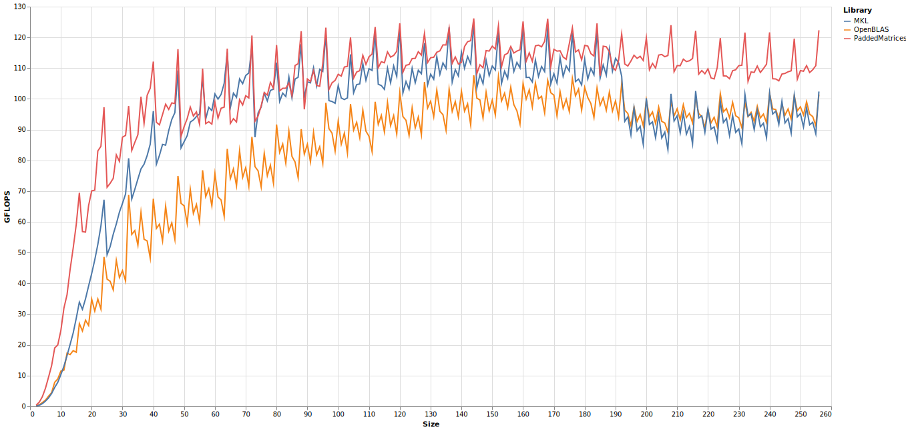

# PaddedMatrices

[](https://chriselrod.github.io/PaddedMatrices.jl/stable)
[](https://chriselrod.github.io/PaddedMatrices.jl/dev)
[](https://github.com/chriselrod/PaddedMatrices.jl/actions?query=workflow%3ACI)
[/badge.svg)](https://github.com/chriselrod/PaddedMatrices.jl/actions?query=workflow%3A%22CI+%28Julia+nightly%29%22)
[](https://codecov.io/gh/chriselrod/PaddedMatrices.jl)

## Quick Start

```julia
julia> using PaddedMatrices

julia> jmult!(C, A, B) # (multi-threaded) multiply A×B and store the result in C (overwriting the contents of C)

julia> jmul!(C, A, B) # (single-threaded) multiply A×B and store the result in C (overwriting the contents of C)
```

If you want to use the multi-threaded functions, remember to start Julia with multiple threads, e.g.:
- `julia -t auto`
- `julia -t 8`
- Set the `JULIA_NUM_THREADS` environment variable to `8` **before** starting Julia

## Usage

This library provides a few array types, as well as pure-Julia matrix multiplication.

The native types are optionally statically sized, and optionally given padding (the default) to ensure that all columns are aligned. The following chart shows single-threaded benchmarks on a few different CPUS, comparing:

* `SMatrix` and `MMatrix` multiplication from [StaticArrays.jl](https://github.com/JuliaArrays/StaticArrays.jl). Beyond `14`x`14`x`14`, MMatrix will switch to using `LinearAlgebra.BLAS.gemm!`.
* `StrideArray`, with compile-time known sizes, and an unsafe `PtrArray` that once upon a time had a lower constant overhead, but that problem seems to have been solved on Julia 1.6 (the Cascadelake-AVX512 benchmarks, below).
* The base `Matrix{Float64}` type, using the pure-Julia `PaddedMatrices.jmul!` method.

All matrices were square; the `x`-axis reports size of each dimension. Benchmarks ranged from `2`x`2` matrices through `48`x`48`. The `y`-axis reports double-precision GFLOPS. That is billions of double precision floating point operations per second. Higher is better.

10980XE, a Cascadelake-X CPU with AVX512:

i7 1165G7, a Tigerlake laptop CPU with AVX512:

i3-4010U, a Haswell CPU with AVX2:


`MMatrix` performed much better beyond `14`x`14` relative to the others on Haswell because `LinearAlgebra.BLAS.gemm!` on that computer was using `MKL` instead of `OpenBLAS` (the easiest way to change this is using [MKL.jl](https://github.com/JuliaComputing/MKL.jl)).

`StaticArray`s currently relies on unrolling the operations, and taking advantage of LLVM's [SLP vectorizer](https://llvm.org/docs/Vectorizers.html#the-slp-vectorizer). This approach can work well for very small arrays, but scales poorly. With AVX2, dynamically-sized matrix multiplication of regular `Array{Float64,2}` arrays was faster starting from `7`x`7`, despite not being able to specialize on the size of the arrays, unlike the `SMatrix` and `MMatrix` versions. This also means that the method didn't have to recompile (in order to specialize) on the `7`x`7` `Matrix{Float64}`s.
With AVX512, the `SMatrix` method was faster than the dynamically sized method until the matrices were `9`x`9`, but quickly fell behind after this.
I did not benchmark `StaticArray`s larger than `20`x`20` on some platforms to speed up the benchmarks and skip the long compile times.

The size-specializing methods for `FixedSizeArray`s and `PtrArray`s matched `SMatrix`'s performance from the beginning, leaving the `SMatrix` method behind starting with `5`x`5` on the AVX2 systems, and `3`x`3` with AVX512.

PaddedMatrices relies on [LoopVectorization.jl](https://github.com/chriselrod/LoopVectorization.jl) for code-generation.

One of the goals of PaddedMatrices.jl is to provide good performance across a range of practical sizes.

How does the dynamic `jmul!` compare with OpenBLAS and MKL at larger sizes? Below are more single-threaded `Float64` benchmarks on the 10980XE. Size range from `2`x`2` through `256`x`256`:

Tigerlake laptop (same as earlier):


Performance is quite strong over this size range, especially compared the the default OpenBLAS, which does not adaptively change packing strategy as a function of size.

Extending the benchmarks from `256`x`256` through `2000`x`2000`, we see that performance does start to fall behind after a few hundred:


Performance still needs work. In particular
1) Tuning of blocking parameters at larger sizes
2) Possibly switching packed arrays from column to panel-major storage.
3) Better prefetching.
4) Diagnosing and fixing the cause of erratic performance.

As an illustration of the last point, consider multiplication of `71`x`71` matrices. Setup:
```julia
julia> using PaddedMatrices, LinuxPerf

julia> M = K = N = 71;

julia> A = rand(M,K); B = rand(K,N); C2 = @time(A * B); C1 = similar(C2);
  0.000093 seconds (2 allocations: 39.516 KiB)

julia> @time(PaddedMatrices.jmul!(C1,A,B)) ≈ C1 # time to first matmul
  9.937127 seconds (21.34 M allocations: 1.234 GiB, 2.46% gc time)
true

julia> foreachmklmul!(C, A, B, N) = foreach(_ -> PaddedMatrices.jmul!(C, A, B), Base.OneTo(N))
```
And then sample `@pstats` results:
```
julia> @pstats "cpu-cycles,(instructions,branch-instructions,branch-misses),(task-clock,context-switches,cpu-migrations,page-faults),(L1-dcache-load-misses,L1-dcache-loads,L1-icache-load-misses),(dTLB-load-misses,dTLB-loads),(iTLB-load-misses,iTLB-loads)" (@time foreachmul!(C2, A, B, 1_000_000))
  6.701603 seconds
━━━━━━━━━━━━━━━━━━━━━━━━━━━━━━━━━━━━━━━━━━━
╶ cpu-cycles               2.74e+10   42.9%  #  4.1 cycles per ns
┌ instructions             7.96e+10   28.6%  #  2.9 insns per cycle
│ branch-instructions      1.80e+09   28.6%  #  2.3% of instructions
└ branch-misses            3.39e+06   28.6%  #  0.2% of branch instructions
┌ task-clock               6.70e+09  100.0%
│ context-switches         9.00e+00  100.0%
│ cpu-migrations           0.00e+00  100.0%
└ page-faults              0.00e+00  100.0%
┌ L1-dcache-load-misses    6.78e+09   14.3%  # 26.4% of loads
│ L1-dcache-loads          2.57e+10   14.3%
└ L1-icache-load-misses    3.08e+06   14.3%
┌ dTLB-load-misses         3.43e+02   14.3%
└ dTLB-loads               2.56e+10   14.3%
┌ iTLB-load-misses         1.03e+05   28.6%
└ iTLB-loads               3.16e+04   28.6%
━━━━━━━━━━━━━━━━━━━━━━━━━━━━━━━━━━━━━━━━━━━

julia> @pstats "cpu-cycles,(instructions,branch-instructions,branch-misses),(task-clock,context-switches,cpu-migrations,page-faults),(L1-dcache-load-misses,L1-dcache-loads,L1-icache-load-misses),(dTLB-load-misses,dTLB-loads),(iTLB-load-misses,iTLB-loads)" (@time foreachmul!(C2, A, B, 1_000_000))
  7.222783 seconds
━━━━━━━━━━━━━━━━━━━━━━━━━━━━━━━━━━━━━━━━━━━
╶ cpu-cycles               2.95e+10   42.9%  #  4.1 cycles per ns
┌ instructions             7.96e+10   28.6%  #  2.7 insns per cycle
│ branch-instructions      1.80e+09   28.6%  #  2.3% of instructions
└ branch-misses            3.50e+06   28.6%  #  0.2% of branch instructions
┌ task-clock               7.22e+09  100.0%
│ context-switches         1.00e+01  100.0%
│ cpu-migrations           0.00e+00  100.0%
└ page-faults              0.00e+00  100.0%
┌ L1-dcache-load-misses    6.81e+09   14.3%  # 26.6% of loads
│ L1-dcache-loads          2.57e+10   14.3%
└ L1-icache-load-misses    3.38e+06   14.3%
┌ dTLB-load-misses         2.10e+02   14.3%
└ dTLB-loads               2.57e+10   14.3%
┌ iTLB-load-misses         1.12e+05   28.6%
└ iTLB-loads               3.60e+04   28.6%
━━━━━━━━━━━━━━━━━━━━━━━━━━━━━━━━━━━━━━━━━━━
```
The difference in `L1-dcache-load-misses` looks relatively minor between these runs, yet we see nearly an 8% difference in performance and instructions per clock cycle. The first time corresponds to a mean of nearly 107 GFLOPS across the 1 million matrix multiplications, while the second corresponds to less than 100. I'm still investigating the cause. I do not see such erratic performance with MKL, for example.


Additionally, the library uses [VectorizedRNG.jl](https://github.com/chriselrod/VectorizedRNG.jl) for random number generation. While we may pay the price of the `GC` vs `StaticArrays.SMatrix`, we still actually end up faster:
```julia
julia> using PaddedMatrices, StaticArrays, BenchmarkTools

julia> @benchmark @SMatrix rand(8,8)
BenchmarkTools.Trial:
  memory estimate:  0 bytes
  allocs estimate:  0
  --------------
  minimum time:     72.999 ns (0.00% GC)
  median time:      73.078 ns (0.00% GC)
  mean time:        76.228 ns (0.00% GC)
  maximum time:     139.795 ns (0.00% GC)
  --------------
  samples:          10000
  evals/sample:     973

julia> @benchmark @StrideArray rand(8,8)
BenchmarkTools.Trial:
  memory estimate:  544 bytes
  allocs estimate:  1
  --------------
  minimum time:     23.592 ns (0.00% GC)
  median time:      46.570 ns (0.00% GC)
  mean time:        54.569 ns (9.42% GC)
  maximum time:     711.433 ns (91.35% GC)
  --------------
  samples:          10000
  evals/sample:     993

julia> @benchmark @SMatrix randn(8,8)
BenchmarkTools.Trial:
  memory estimate:  0 bytes
  allocs estimate:  0
  --------------
  minimum time:     176.371 ns (0.00% GC)
  median time:      187.033 ns (0.00% GC)
  mean time:        191.685 ns (0.00% GC)
  maximum time:     370.407 ns (0.00% GC)
  --------------
  samples:          10000
  evals/sample:     728

julia> @benchmark @StrideArray randn(8,8)
BenchmarkTools.Trial:
  memory estimate:  544 bytes
  allocs estimate:  1
  --------------
  minimum time:     58.704 ns (0.00% GC)
  median time:      68.225 ns (0.00% GC)
  mean time:        77.303 ns (8.01% GC)
  maximum time:     816.444 ns (89.50% GC)
  --------------
  samples:          10000
  evals/sample:     982
```
Thus, if you're generating a lot of random matrices, you're actually better off (performance-wise) biting the GC-bullet!

Of course, you can still preallocate for even better performance:.
```julia
julia> A = StrideArray{Float64}(undef, (StaticInt(8),StaticInt(8)));

julia> @benchmark rand!($A)
BenchmarkTools.Trial:
  memory estimate:  0 bytes
  allocs estimate:  0
  --------------
  minimum time:     11.436 ns (0.00% GC)
  median time:      11.645 ns (0.00% GC)
  mean time:        12.382 ns (0.00% GC)
  maximum time:     72.118 ns (0.00% GC)
  --------------
  samples:          10000
  evals/sample:     999

julia> @benchmark randn!($A)
BenchmarkTools.Trial:
  memory estimate:  0 bytes
  allocs estimate:  0
  --------------
  minimum time:     55.393 ns (0.00% GC)
  median time:      63.583 ns (0.00% GC)
  mean time:        64.500 ns (0.00% GC)
  maximum time:     464.260 ns (0.00% GC)
  --------------
  samples:          10000
  evals/sample:     984
```

By preallocating arrays, you can gain additional performance.

In the future, I'll try to ensure that a large number of basic functions and operations (e.g. matrix multiplication, broadcasting, creation) do not force heap-allocation even when they do not inline, to make it easier to write non-allocating code with these mutable arrays.


These arrays also use [LoopVectorization.jl](https://github.com/chriselrod/LoopVectorization.jl) for broadcasts:
```julia
julia> using PaddedMatrices, StaticArrays, BenchmarkTools

julia> Afs = @StrideArray randn(13,29); Asm = SMatrix{13,29}(Array(Afs));

julia> bfs = @StrideArray rand(13); bsv = SVector{13}(bfs);

julia> cfs = @StrideArray rand(29); csv = SVector{29}(cfs);

julia> Dfs = @. exp(Afs) + bfs * log(cfs');

julia> Dfs ≈ @. exp(Asm) + bsv * log(csv')
true

julia> @benchmark @. exp($Afs) + $bfs * log($cfs') # StrideArrays, allocating
BenchmarkTools.Trial:
  memory estimate:  3.12 KiB
  allocs estimate:  1
  --------------
  minimum time:     513.243 ns (0.00% GC)
  median time:      591.307 ns (0.00% GC)
  mean time:        774.968 ns (16.80% GC)
  maximum time:     23.365 μs (74.48% GC)
  --------------
  samples:          10000
  evals/sample:     189

julia> @benchmark @. exp($Asm) + $bsv * log($csv') # StaticArrays, non-allocating but much slower
BenchmarkTools.Trial:
  memory estimate:  0 bytes
  allocs estimate:  0
  --------------
  minimum time:     2.650 μs (0.00% GC)
  median time:      2.736 μs (0.00% GC)
  mean time:        2.881 μs (0.00% GC)
  maximum time:     13.431 μs (0.00% GC)
  --------------
  samples:          10000
  evals/sample:     9

julia> @benchmark @. $Dfs = exp($Afs) + $bfs * log($cfs') # StrideArrays, using pre-allocated output
BenchmarkTools.Trial:
  memory estimate:  0 bytes
  allocs estimate:  0
  --------------
  minimum time:     344.828 ns (0.00% GC)
  median time:      386.982 ns (0.00% GC)
  mean time:        388.061 ns (0.00% GC)
  maximum time:     785.701 ns (0.00% GC)
  --------------
  samples:          10000
  evals/sample:     221
```


