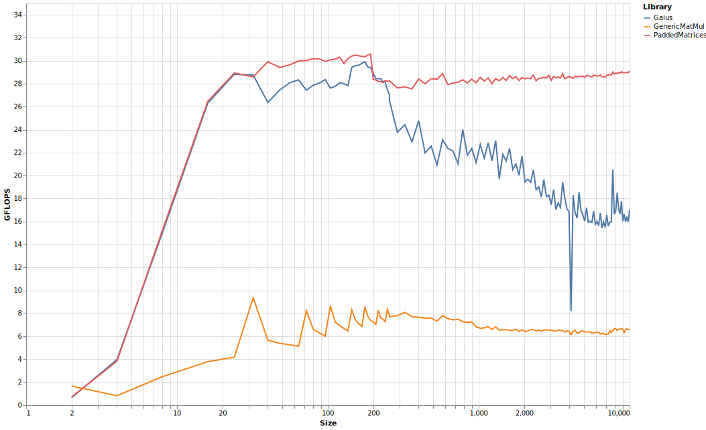

# PaddedMatrices

[](https://chriselrod.github.io/PaddedMatrices.jl/stable)
[](https://chriselrod.github.io/PaddedMatrices.jl/latest)
[](https://travis-ci.com/chriselrod/PaddedMatrices.jl)
[](https://ci.appveyor.com/project/chriselrod/PaddedMatrices-jl)
[](https://codecov.io/gh/chriselrod/PaddedMatrices.jl)

# Usage

This library provides a few array types, as well as pure-Julia matrix multiplication.

The native types are optionally statically sized, and optionally given padding to ensure that all columns are aligned. The following chart shows benchmarks on a 10980XE CPU, comparing:

* `SMatrix` and `MMatrix` multiplication from [StaticArrays.jl](https://github.com/JuliaArrays/StaticArrays.jl).
* `FixedSizeArray` from this library without any padding.
* `FixedSizeArray` from this library with padding, named `PaddedArray` in the legend.
* The base `Matrix{Float64}` type, using the `PaddedMatrices.jmul!` method.


All matrices were square and filled with `Float64` elements. Size refers to the number of rows and columns.
Inplace multiplication was used for all but the `SArray`. For the `FixedSizeArray`s, `LinearAlgebra.mul!` simple redirects to `jmul!`, which is capable of taking advantage of static size information.

`StaticArray`s currently relies on unrolling the operations, and taking advantage of LLVM's powerful [SLP vectorizer](https://llvm.org/docs/Vectorizers.html#the-slp-vectorizer). It performs best for `2x2`, `3x3`, `4x4`, `6x6`, and `8x8` matrices on this architecture. Between stack allocation and marking these operations for inline, `SMatrix` achieves better performance than the alternatives at these sizes.

PaddedMatrices relies on [LoopVectorization.jl](https://github.com/chriselrod/LoopVectorization.jl) to generate microkernels. Perhaps I should make it unroll more agressively at small static sizes, and also mark it for inlining. For now, it doesn't achieve quite the same performance as an `SMatrix` at `8x8`, `6x6`, and `4x4` and below. However, at `9x9` and beyond, even the dynamically sized `PaddedMatrices.jmul!` method achieves better performance than `SMatrix` or `MMatrix`. Of course, `StaticArrays` is primarily concerned with `10x10` matrices and smaller, and the `SMatrix` type allows you to use the more convenient non-mutating API without worrying about allocations or memory management.

How does `jmul!` compare with OpenBLAS and MKL at larger sizes? Single threaded `Float64` benchmarks:

It's slower than both OpenBLAS and MKL, but (on this architecture) it's closer to MKL than MKL is to OpenBLAS at large sizes. I also added [Gaius.jl](https://github.com/MasonProtter/Gaius.jl) for comparison. It also uses LoopVectorization to generate the microkernels, but uses divide and conquer to improve cache locality, rather than tiling and packing like the others. The divide and conquer approach yields much better performance than not handling cache locality; I may add a naive implementation for comparison for purposes of comparison eventually, but Julia's generic matmul -- which still makes some effort for cache optimality -- could give some perspective in the integer benchmarks below.

But before moving onto integers, `Float32` benchmarks:

Both BLAS libraries again beat `jmul!`. OpenBLAS and MKL are now neck and neck.

The BLAS libraries do not support integer multiplication, so the comparison is now with Julia's [generic matmul](https://github.com/JuliaLang/julia/blob/b1f51df1088b2ab4e1c954537fd8c22b9b5f19ac/stdlib/LinearAlgebra/src/matmul.jl#L730); `Int64`:

64-bit integer multiplication is very slow on most platforms. With AVX2, it is implemented with repeated 32-bit integer multiplications, shifts, and additions (`(a + b)*(c + d) = ad + bc + bd`; you can drop the `ac` because it overflows). With AVX512 (like the benchmark rig), it uses the `vpmullq` instruction, which is slow.


`Int32` multiplication is much faster, but still lags behind `Float64` performance.
For some reason, the generic matmul is slower for `Int32`; I have not investigated why.

There is also a threaded `PaddedMatrices.jmult!`, however it is not well optimized. It currently naively spawns a new task for each packed block of `A` and `B`. When `A` and `B` aren't large, this leads to too few tasks for much parallelism. When they are large, the number of tasks is excessive.

Additionally, the library uses [VectorizedRNG.jl](https://github.com/chriselrod/VectorizedRNG.jl) for random number generation.
```julia
julia> using PaddedMatrices, StaticArrays, BenchmarkTools

julia> @benchmark @SMatrix rand(8,8)
BenchmarkTools.Trial: 
  memory estimate:  0 bytes
  allocs estimate:  0
  --------------
  minimum time:     95.624 ns (0.00% GC)
  median time:      96.285 ns (0.00% GC)
  mean time:        96.350 ns (0.00% GC)
  maximum time:     119.485 ns (0.00% GC)
  --------------
  samples:          10000
  evals/sample:     968

julia> @benchmark @FixedSize rand(8,8)
BenchmarkTools.Trial: 
  memory estimate:  544 bytes
  allocs estimate:  1
  --------------
  minimum time:     30.688 ns (0.00% GC)
  median time:      36.902 ns (0.00% GC)
  mean time:        47.708 ns (20.02% GC)
  maximum time:     1.161 μs (88.61% GC)
  --------------
  samples:          10000
  evals/sample:     995

julia> @benchmark @SMatrix randn(8,8)
BenchmarkTools.Trial: 
  memory estimate:  0 bytes
  allocs estimate:  0
  --------------
  minimum time:     259.418 ns (0.00% GC)
  median time:      267.362 ns (0.00% GC)
  mean time:        268.058 ns (0.00% GC)
  maximum time:     347.910 ns (0.00% GC)
  --------------
  samples:          10000
  evals/sample:     390

julia> @benchmark @FixedSize randn(8,8)
BenchmarkTools.Trial: 
  memory estimate:  544 bytes
  allocs estimate:  1
  --------------
  minimum time:     95.552 ns (0.00% GC)
  median time:      100.451 ns (0.00% GC)
  mean time:        111.481 ns (8.42% GC)
  maximum time:     1.269 μs (84.12% GC)
  --------------
  samples:          10000
  evals/sample:     954
```
and it uses [LoopVectorization.jl](https://github.com/chriselrod/LoopVectorization.jl) for broadcasts:
```julia
julia> using PaddedMatrices, StaticArrays, BenchmarkTools

julia> Afs = @FixedSize randn(13,29); Asm = SMatrix{13,29}(Array(Afs));

julia> bfs = @FixedSize rand(13); bsv = SVector{13}(bfs);

julia> cfs = @FixedSize rand(29); csv = SVector{29}(cfs);

julia> Dfs = @. exp(Afs) + bfs * log(cfs');

julia> Dfs ≈ @. exp(Asm) + bsv * log(csv')
true

julia> @benchmark @. exp($Afs) + $bfs * log($cfs')
BenchmarkTools.Trial:
  memory estimate:  4.06 KiB
  allocs estimate:  1
  --------------
  minimum time:     645.871 ns (0.00% GC)
  median time:      703.147 ns (0.00% GC)
  mean time:        790.847 ns (10.55% GC)
  maximum time:     11.067 μs (84.82% GC)
  --------------
  samples:          10000
  evals/sample:     170

julia> @benchmark @. exp($Asm) + $bsv * log($csv')
BenchmarkTools.Trial:
  memory estimate:  0 bytes
  allocs estimate:  0
  --------------
  minimum time:     3.620 μs (0.00% GC)
  median time:      3.658 μs (0.00% GC)
  mean time:        3.669 μs (0.00% GC)
  maximum time:     6.189 μs (0.00% GC)
  --------------
  samples:          10000
  evals/sample:     8

julia> @benchmark @. $Dfs = exp($Afs) + $bfs * log($cfs')
BenchmarkTools.Trial:
  memory estimate:  0 bytes
  allocs estimate:  0
  --------------
  minimum time:     461.500 ns (0.00% GC)
  median time:      462.199 ns (0.00% GC)
  mean time:        462.732 ns (0.00% GC)
  maximum time:     599.357 ns (0.00% GC)
  --------------
  samples:          10000
  evals/sample:     196
```


