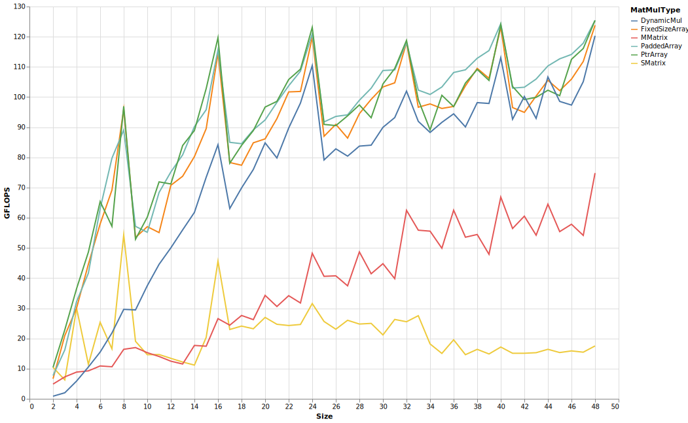

# PaddedMatrices

[](https://chriselrod.github.io/PaddedMatrices.jl/stable)
[](https://chriselrod.github.io/PaddedMatrices.jl/latest)
[](https://travis-ci.com/chriselrod/PaddedMatrices.jl)
[](https://ci.appveyor.com/project/chriselrod/PaddedMatrices-jl)
[](https://codecov.io/gh/chriselrod/PaddedMatrices.jl)

# Usage

This library provides a few array types, as well as pure-Julia matrix multiplication.

The native types are optionally statically sized, and optionally given padding (the default) to ensure that all columns are aligned. The following chart shows single-threaded benchmarks on a few different CPUS, comparing:

* `SMatrix` and `MMatrix` multiplication from [StaticArrays.jl](https://github.com/JuliaArrays/StaticArrays.jl). Beyond 14x14x14, MMatrix will switch to using `LinearAlgebra.BLAS.gemm!`.
* `FixedSizeArray` from this library without any padding.
* `FixedSizeArray` from this library with padding, named `PaddedArray` in the legend.
* The base `Matrix{Float64}` type, using the pure-Julia `PaddedMatrices.jmul!` method.

All matrices were square; the `x`-axis reports size of each dimension. Benchmarks ranged from `2`x`2` matrices through `48`x`48`. The `y`-axis reports double-precision GFLOPS. That is billions of double precision floating point operations per second. Higher is better.

10980XE, a Cascadelake-X CPU with AVX512:

, a Skylake CPU with AVX2:

, a Haswell CPU with AVX2:


`MMatrix` performed much better beyond 14x14 relative to the others on Haswell because `LinearAlgebra.BLAS.gemm!` on that computer was using `MKL` instead of `OpenBLAS` (the easiest way to change this is using [MKL.jl](https://github.com/JuliaComputing/MKL.jl)).

`StaticArray`s currently relies on unrolling the operations, and taking advantage of LLVM's [SLP vectorizer](https://llvm.org/docs/Vectorizers.html#the-slp-vectorizer). This approach can work well for very small arrays, but scales poorly. With AVX2, dynamically-sized matrix multiplication of regular `Array{Float64,2}` arrays was faster starting from `7`x`7`, despite not being able to specialize on the size of the arrays, unlike the `SMatrix` and `MMatrix` versions. This also means that the method didn't have to recompile (in order to specialize) on the `7`x`7` `Matrix{Float64}`s.

With AVX512, the `SMatrix` method was faster than the dynamically sized method until the matrices were `9`x`9`, but quickly fell behind after this.

The size-specializing methods for `FixedSizeArray`s and `PtrArray`s matched `SMatrix`'s performance from the beginning, leaving the `SMatrix` method behind starting with `5`x`5` on the AVX2 systems, and `3`x`3` with AVX512.

PaddedMatrices relies on [LoopVectorization.jl](https://github.com/chriselrod/LoopVectorization.jl) for code-generation.

One of the goals of PaddedMatrices.jl is to provide good performance across a range of practical sizes.

How does the dynamic `jmul!` compare with OpenBLAS and MKL at larger sizes? Below are more single-threaded `Float64` benchmarks on the 10980XE. Size range from `2`x`2` through `256`x`256`:

Benchmarks from `256`x`256` through `2000`x`2000`:


Skylake:


Additionally, the library uses [VectorizedRNG.jl](https://github.com/chriselrod/VectorizedRNG.jl) for random number generation. Unfortunately, here is where we pay the price of GC.
```julia
julia> using PaddedMatrices, StaticArrays, BenchmarkTools

julia> @benchmark @SMatrix rand(8,8)
BenchmarkTools.Trial:
  memory estimate:  0 bytes
  allocs estimate:  0
  --------------
  minimum time:     90.861 ns (0.00% GC)
  median time:      91.515 ns (0.00% GC)
  mean time:        91.556 ns (0.00% GC)
  maximum time:     122.468 ns (0.00% GC)
  --------------
  samples:          10000
  evals/sample:     968

julia> @benchmark @FixedSize rand(8,8)
BenchmarkTools.Trial:
  memory estimate:  576 bytes
  allocs estimate:  1
  --------------
  minimum time:     52.154 ns (0.00% GC)
  median time:      169.038 ns (0.00% GC)
  mean time:        189.961 ns (20.91% GC)
  maximum time:     18.303 μs (99.10% GC)
  --------------
  samples:          10000
  evals/sample:     986

julia> @benchmark @SMatrix randn(8,8)
BenchmarkTools.Trial:
  memory estimate:  0 bytes
  allocs estimate:  0
  --------------
  minimum time:     220.342 ns (0.00% GC)
  median time:      227.329 ns (0.00% GC)
  mean time:        227.426 ns (0.00% GC)
  maximum time:     430.583 ns (0.00% GC)
  --------------
  samples:          10000
  evals/sample:     535

julia> @benchmark @FixedSize randn(8,8)
BenchmarkTools.Trial:
  memory estimate:  576 bytes
  allocs estimate:  1
  --------------
  minimum time:     133.292 ns (0.00% GC)
  median time:      262.179 ns (0.00% GC)
  mean time:        280.922 ns (13.84% GC)
  maximum time:     20.800 μs (99.02% GC)
  --------------
  samples:          10000
  evals/sample:     873
```
Thus, it is recomended you either preallocate and mutate existing arrays, or find some other approach to working with these.
In the future, I'll try to ensure that a large number of basic functions and operations (e.g. matrix multiplication, broadcasting, creation)
inline for small arrays, so that the compiler will be able to stack-allocate them and avoid the heap and GC altogether, so long as they don't escape.

These arrays also use [LoopVectorization.jl](https://github.com/chriselrod/LoopVectorization.jl) for broadcasts:
```julia
julia> using PaddedMatrices, StaticArrays, BenchmarkTools

julia> Afs = @FixedSize randn(13,29); Asm = SMatrix{13,29}(Array(Afs));

julia> bfs = @FixedSize rand(13); bsv = SVector{13}(bfs);

julia> cfs = @FixedSize rand(29); csv = SVector{29}(cfs);

julia> Dfs = @. exp(Afs) + bfs * log(cfs');

julia> Dfs ≈ @. exp(Asm) + bsv * log(csv')
true

julia> @benchmark @. exp($Afs) + $bfs * log($cfs') # FixedSizeArrays, allocating
BenchmarkTools.Trial:
  memory estimate:  3.75 KiB
  allocs estimate:  1
  --------------
  minimum time:     659.503 ns (0.00% GC)
  median time:      715.554 ns (0.00% GC)
  mean time:        850.659 ns (11.74% GC)
  maximum time:     51.319 μs (96.06% GC)
  --------------
  samples:          10000
  evals/sample:     149

julia> @benchmark @. exp($Asm) + $bsv * log($csv') # StaticArrays, non-allocating but much slower
BenchmarkTools.Trial:
  memory estimate:  0 bytes
  allocs estimate:  0
  --------------
  minimum time:     3.676 μs (0.00% GC)
  median time:      3.686 μs (0.00% GC)
  mean time:        3.691 μs (0.00% GC)
  maximum time:     6.073 μs (0.00% GC)
  --------------
  samples:          10000
  evals/sample:     8

julia> @benchmark @. $Dfs = exp($Afs) + $bfs * log($cfs') # FixedSizeArrays, using pre-allocated output
BenchmarkTools.Trial:
  memory estimate:  0 bytes
  allocs estimate:  0
  --------------
  minimum time:     496.433 ns (0.00% GC)
  median time:      498.995 ns (0.00% GC)
  mean time:        499.542 ns (0.00% GC)
  maximum time:     624.820 ns (0.00% GC)
  --------------
  samples:          10000
  evals/sample:     194
  ```


