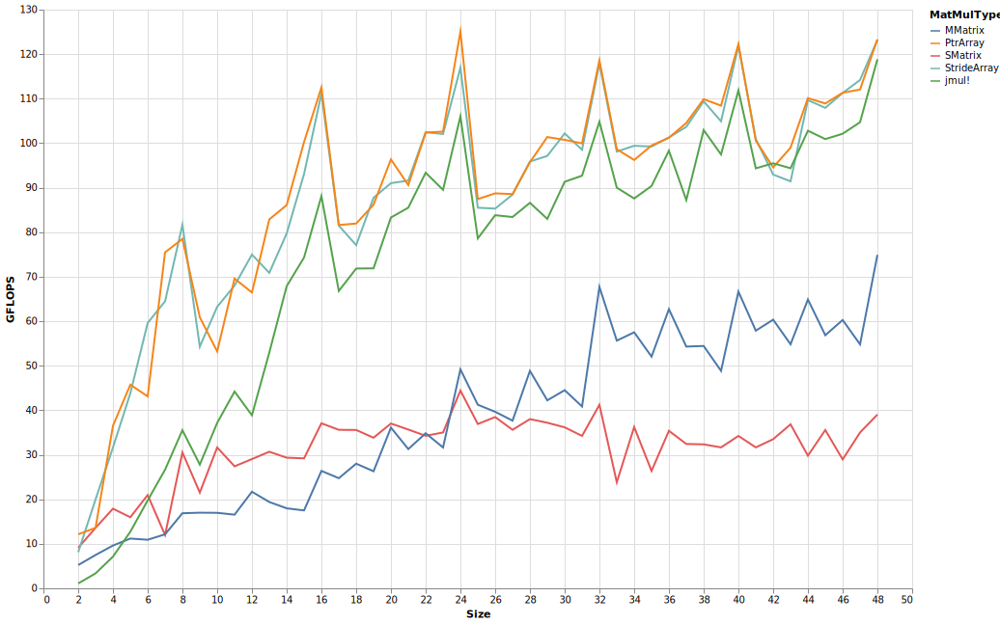
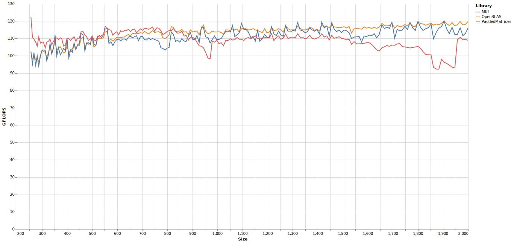

# Cascadelake

Cascadelake CPUs feature 2 512-bit-fma units, and thus can achieve high FLOPS in BLAS-like operations.
The particular CPU on which these benchmarks were run had its heavy-AVX512 clock speed set to 4.1 GHz, providing a theoretical peak of 131.2 GFLOPS/core.

Statically sized benchmarks vs [StaticArrays.jl](https://github.com/JuliaArrays/StaticArrays.jl):

The `SMatrix` and `MMatrix` are the immutable and immutable matrix types from `StaticArrays.jl`, respectively, while `StrideArray.jl` and `PtrArray.jl` are mutable array types with optional static sizing providing by `PaddedMatrices.jl`. The benchmarks also included `jmul!` on base `Matrix{Float64}`, demonstrating the performance of PaddedMatrices's fully dynamic multiplication function.

`SMatrix` were only benchmarked up to size `20`x`20`. As their performance at larger sizes recently increased, I'll increase the size range at which I benchmark them in the future.

The fully dynamic multiplication is competitive with `MKL` and `OpenBLAS` from around `2`x`2` to `256`x`256`:

However, beyond this size, performance begins to fall behind:

`OpenBLAS` eventually ascends to about 120 GFLOPS, but PaddedMatrices seems stuck at around 100 GFLOPS.

The packing and blocking need work.

Multithreading benchmarks were run using [BLASBenchmarks.jl](https://github.com/chriselrod/BLASBenchmarks.jl).

