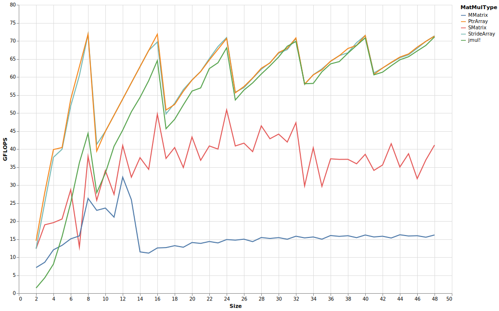
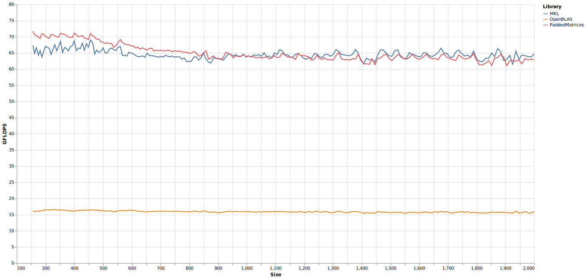

# Tigerlake

Tigerlake CPUs feature just a single 512-bit-fma unit, and thus their theoretical peak FLOPS are comparable with AVX2 CPUs featuing two 256-bit FMA units, such as Intel's Skylake or AMD's Zen2.
The much larger register file that AVX512 provides combined with its comparatively much larger L1 and L2 caches (and no doubt helped by the large out of order buffer) make it comparatively very easy to attain near peak performance on Tigerlake.

Statically sized benchmarks vs [StaticArrays.jl](https://github.com/JuliaArrays/StaticArrays.jl):

The `SMatrix` and `MMatrix` are the immutable and immutable matrix types from `StaticArrays.jl`, respectively, while `StrideArray.jl` and `PtrArray.jl` are mutable array types with optional static sizing providing by `PaddedMatrices.jl`. The benchmarks also included `jmul!` on base `Matrix{Float64}`, demonstrating the performance of PaddedMatrices's fully dynamic multiplication function.

`SMatrix` were only benchmarked up to size `20`x`20`. As their performance at larger sizes recently increased, I'll increase the size range at which I benchmark them in the future.

The fully dynamic multiplication is competitive with `MKL` and `OpenBLAS` from around `2`x`2` to `256`x`256`:

Unlike the Cascadelake CPU, it was able to hold on with `MKL` at least through `2000`x`2000`:

The version of `OpenBLAS` used (0.3.10) didn't support Tigerlake yet.
Unlike Cascadelake, where approaching the CPU's peak performance can be challenging, it is easy with Tigerlake: Tigerlake is at least as advanced in all respects related to keeping its execution units fed, and it has half as many FMA-units to feed. Hence it managed to keep pace with MKL over this range.

Given that `LoopVectorization` by itself [does better on Cascadelake than PaddedMatrices](https://chriselrod.github.io/LoopVectorization.jl/latest/examples/matrix_multiplication/#Matrix-Multiplication) over the 2-256 size range, it'd be worth comparing Tigerlake with simple `@avx for` loops as well.

